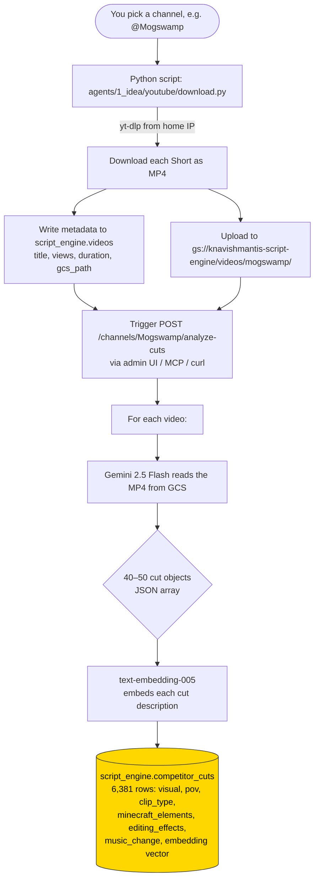
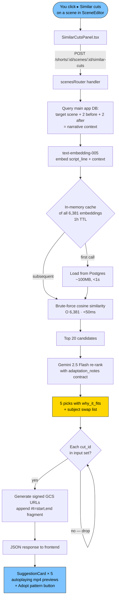
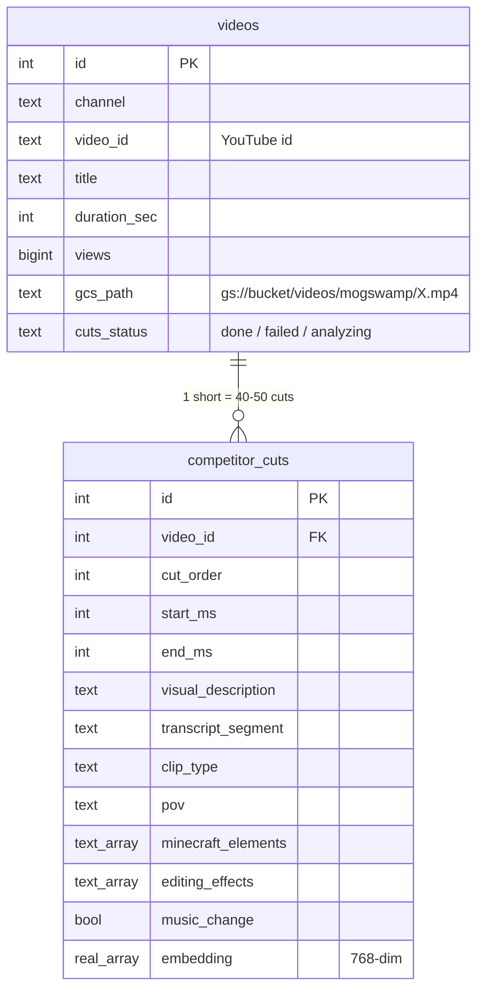

# Mogswamp Reference Library — End-to-End Flow

Mermaid diagrams. View on GitHub (renders natively), or paste into
<https://mermaid.live>. To render locally from a terminal:
`npx -p @mermaid-js/mermaid-cli mmdc -i docs/COMPETITOR_CUT_LIBRARY_FLOW.md -o /tmp/flow.png`.

---

## 1. Build phase (happens once — already done for Mogswamp)

---

## 2. Query phase (happens every time you click "Similar cuts from Mogswamp")

---

## 3. Data model

---

## Why this design

**Grounding.** Every suggestion points to a *real* indexed cut. The rerank LLM
can only return `cut_id`s from the 20 candidates we hand it — if it invents
one, we drop it. So the user always gets real video they can watch, not
AI-hallucinated shot descriptions.

**Technique-grounded, subject-adaptable.** The reference cut's composition
and editing pattern is immutable (chicken + villagers + cinematic studio).
The `adaptation_notes` array carries the surface swaps to fit your script
(chicken → dolphin). Changing the subject doesn't change the craft.

**Brute force over vector DB.** 6,381 cuts × 768 floats = ~20MB of vectors.
A full cosine scan takes <50ms in Node. Vector DBs (pgvector, pinecone)
would add infra without speedup at this scale.

**Gemini Flash everywhere.** Video analysis + rerank both use
gemini-2.5-flash. ~$0.0002 per user query; ~$0.01 per short ingested.
Pro reserved for calibration only (user's $20 budget cap).
